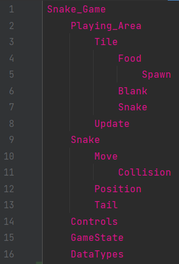
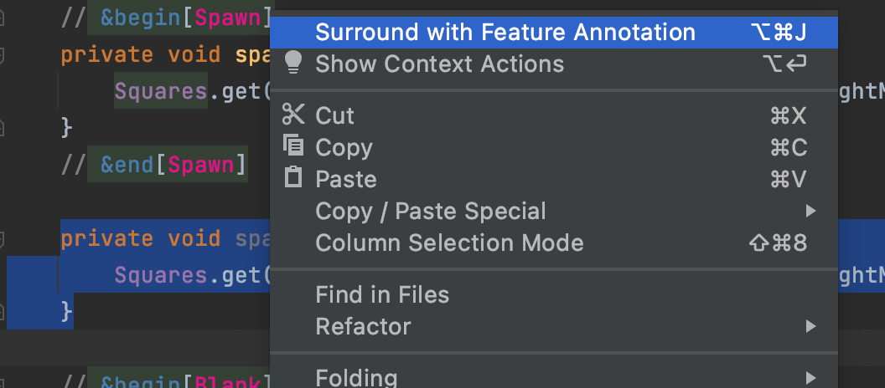

# Purpose:

The purpose of this repo is to test and evaluate the embedded feature annotations plugin
[HAnS](https://bitbucket.org/easelab/hans-text/src) for IntelliJ.

### Requirements:

* IntelliJ installed
* Recommended JDK 14
* Installed HAnS-text plugin

### Installation of the HAnS plugin:

* Open Plugins in Settings/Preferences. Click the settings icon and select "Install Plugin from Disk..."
  
* Choose the path to the zip file of the plugin.

## The Snake

A simple snake game in java, forked from [@hexadeciman](https://github.com/hexadeciman/Snake), using Threads and Java
Swing to display the game. 

### How it looks:

### How it works:

The aim of the game is to make the snake grow as big as possible by moving across the playing area and eating food.
The snake is controlled with the arrow keys of your keyboard. No walls are present in the game so when the snake 
crosses the edge of the playing area it appears at the opposite side. Food is represented by blue squares that 
increases the size of the snake by one square when eaten. After being eaten, the food respawns at a random location
not occupied by the snake. The game is finished only when the snake collides with itself in any way.

The playing area is represented by a grid of tiles where each tile has a color that signals what type of tile is 
located there. The background of the game is filled with white tiles where the snake may move freely. The snake itself
is made up of grey tiles that move according to the directions given by the player. Food are blue tiles that have 
logic to enlarge the snake by one and then respawn.

# Background

As software projects keeps getting bigger and bigger developers often find navigating the code to be a difficult task.
Using features is a common way to talk about code and the product, but it is often difficult to find the features
in code. The use of embedded feature annotations is a way to leave traces of where features are implemented.

## Definition of a feature

> A feature is a characteristic or end-user-visible behaviour of a software system. Features are used in product-line 
> engineering to specify and communicate commonalities and differences of the products between stakeholders, and to 
> guide structure, reuse, and variation across all phases of the software life cycle. - Apel, Batory, Kästner, and Saake 
> (2013)
 
The analogy to the snake game is for example the feature `Controls` which is the collective code and behaviour 
concerned with pressing the arrow keys.

## Feature location

A large part of the work of a developer consists of finding the implementation of a feature in code. This is necessary 
in order to extend, maintain and remove features, and it often requires substantial effort. This activity is known as 
feature location. A definition of feature location reads:

> Feature location is the task of finding the source code in a system that implements a feature. - Krüger, Berger, et 
> al. (2018)

## Embedded Feature Annotations

The usage of feature annotations is to map sections of code to functionality of the software. The intent is that this 
can help developers with feature location. The system of annotations that the HAnS plugin uses is able to map features 
to any file type and programming language (except languages that do not have support for comments). The central part of
this annotation system is a file with the extension `.feature-model`. This is a feature hierarchy model, describing 
feature names, and their hierarchy in textual form. These are all the features present in the system, and they may then 
be referenced by mapping them to code by using the annotations described below. The feature model is where you define a 
feature. The feature model below is contains all features present in the Snake game.

### Feature Reference Names

Inside the feature hierarchy model, features with the same name may appear twice or more often. To reference
features uniquely the individual feature is pre-extended with its ancestor until the combined feature reference is 
unique (separated by "::"). This technique is called Least-Partially-Qualified name, short LPQ. The feature `Snake` 
is mentioned twice above and must therefore be referenced uniquely in the manner below.

### Feature-to-code mapping

The feature-to-code mapping serves to link specific blocks and lines of code to one or more features. The parts of the
source code which are mapped to a certain feature are called annotation scopes. An annotation scope is surrounded by
annotation markers and contains at least one feature reference. In the example below the feature `Move` is mapped to 
the block encapsulated by the `&begin` and `&end` statements. The feature `Collision` is mapped to the single line
where it lies.

### Feature-to-file mapping

The feature-to-file mapping is a specialized file with the extension `.feature-to-file` and is used to map one or more 
file(s) and its/their content to one or more features. All content of the linked file is considered fully to be part of 
the given feature references. The mapping file must be stored in the same folder as the source code files and covers 
only the file in this folder. In the example below each feature is mapped to the file listed above. Additional
mappings can be added beneath existing mappings in the file.

### Feature-to-folder mapping

The purpose of this file is to map complete folders and their content to one or more feature references. The mapping of
feature references to folders allows linking specific features to the folder, including all its sub-folders and files.
With this, the mapping of complete folder structures to features is possible and may substitute the feature-to-file
mapping. The mapping file is located on the top level inside the to be annotated folder. Let's say, for example, that 
a feature relates to all code in a folder, then it could be mapped by writing the feature name in a file with the 
extension `.feature-to-folder` as below. Features must be separated by either spaces or new lines

## HAnS: Helping Annotate Software
The purpose of HAnS is to enable recording and editing support for feature annotations.

#### HAnS-text supports:
* Embedded Feature Annotations
* Syntax Highlighting
* Code Completion
* Referencing
* Refactoring
* Feature Model View
* Live Templates

### Feature Model View
The Feature Model View, from HAnS, is a representation of the feature model. It is available as a tool window at the
bottom left of the display (see below). 

The Feature Model View supports adding, removing and renaming of features (via refactoring) as well as finding the 
usages of features and opening the Feature Model file by jumping to source. These actions make the corresponding changes
to the Feature Model file automatically. If the Feature Model file is changed manually, the Feature Model View is 
updated automatically.

### Live Templates
Live templates are used to insert common constructs into your code. HAnS supports a couple of live templates:
* `&begin` 
  *This template creates a begin tag with a matching end tag.*
* `&line`
  *This template creates a line tag.*
* `&end`
  *This template creates an end tag*
  
To invoke a live template simply start typing the name of it and press `enter` or `tab` on your keyboard to complete the invocation.
#### Surround with Live Templates (Feature Annotation)
Live templates can also be used to surround marked code. To use this mark the code you want to surround press `ctrl-alt-J` (`cmd-option-J`)
and choose the template you want to surround the code with. It can also be found via the right-click menu in the editor.

