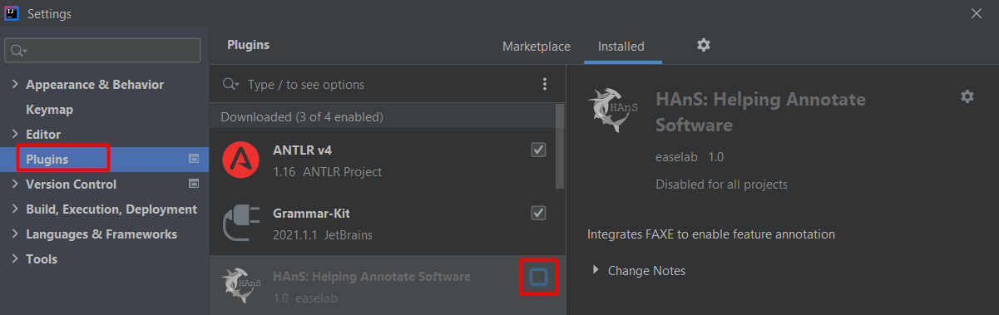

# Tasks to complete

During the task, take notes while coding, so you can answer the questionnaire after completing all the tasks.

## Disable the plugin.
* Open Plugins in Settings/Preferences. Uncheck the box marked in red in the image below.
* Click "Apply".

## First part:

### Warmup task

Add a file with the extension `.feature-to-folder` to the *graphics* package.
* Verify that the feature `Playing_Area` is defined in the Feature Model via the `.feature-model` File.
* Map the feature `Playing_Area` to the new `.feature-to-folder` file by writing it into the file.

You have now mapped the feature *Playing_Area* to the *graphics* directory.

### Task 1

Implement and annotate a feature (choose a fitting name) that adds a red poison tile that if eaten shrinks the snake
by three tiles. If the length of the snake is less than or equal to three, the snake dies. *Hint: The poison would 
follow similar implementation as the feature `Food`.*

**Reminder: Make sure you annotate the code you write!**

### Task 2

Add a file with the extension `.feature-to-file` to the *pojo* package.
* Verify that the feature `Tile` is defined in the Feature Model.
* Map the feature `Tile` to the file `Tuple.java`.

### Task 3

Rename (refactor) the `Position` feature to the new name `Head`, including all references to it.

## Second part:

#### Enable the plugin

1. Open Plugins in Settings/Preferences. Check the box marked in red in the image below.
2. Click "Apply".
    

### Warmup task

Add a file with the extension `.feature-to-folder` to the *pojo* package.
* Verify that the feature `DataTypes` is defined in the Feature Model via the Feature Model View tab (bottom left).
* Map the feature `DataTypes` to the new `.feature-to-folder` file by writing it into the file.

You have now mapped the feature *DataTypes* to the *pojo* directory.

### Task 4

Implement and annotate a feature that raises the difficulty of the game by increasing its speed by one every time the
snake crosses the borders of the playing area. The feature should be defined as a child feature of `GameState` in the
Feature Model. The current difficulty should be displayed as the title of the window, create methods to enable this.
* *Hint 1: The speed of the game is inverted. It is implemented as a sleep call, so the shorter the sleep, the faster the game.*
* *Hint 2: The difficulty may never be equal to or exceed the speed variable.*
* *Hint 3: To check if the snake passes the bottom border check if the head is equal to 0.*
* *Hint 4: Look at the new `Head` feature.*

**Reminder: Make sure you annotate the code you write!**

### Task 5

* Verify that the feature `Controls` is defined in the Feature Model.
* Map the feature `Controls` to the file `KeyboardListener.java` in `.feature-to-file` in the *logic* package.

### Task 6

Rename (refactor) the `Blank` feature to the new name `Background`, including all references to it.

# Answer questions
After the above tasks are completed, fill out the [survey](https://forms.gle/GDeFSyA9ZKico9KF6).